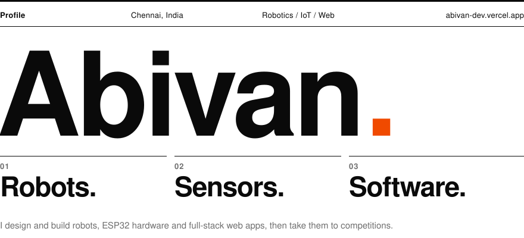
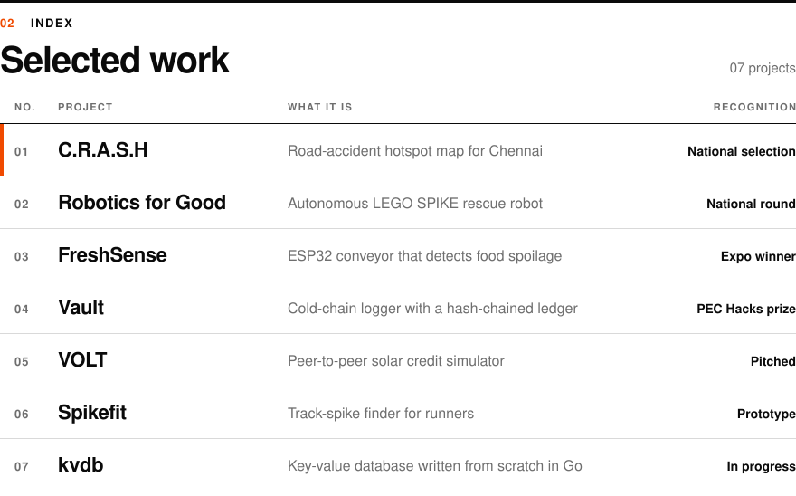
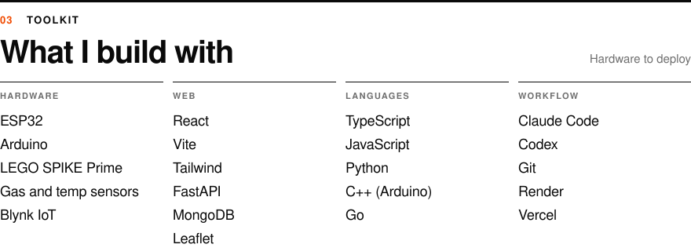
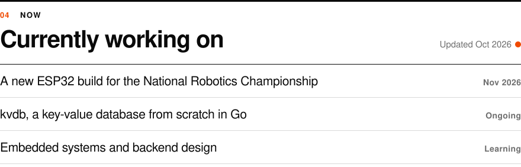
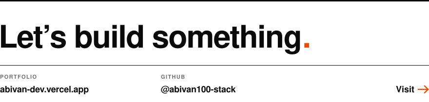

<a href="https://abivan-dev.vercel.app/">
  <picture>
    <source media="(prefers-color-scheme: dark)" srcset="img/hero-dark.svg">
    
  </picture>
</a>

  

<picture>
  <source media="(prefers-color-scheme: dark)" srcset="img/index-dark.svg">
  
</picture>

Source: <a href="https://github.com/abivan100-stack/C.R.A.S.H">C.R.A.S.H</a> &nbsp;·&nbsp; <a href="https://github.com/abivan100-stack/kvdb">kvdb</a> &nbsp;·&nbsp; Write-ups for the rest are on <a href="https://abivan-dev.vercel.app/">my portfolio</a>

  

<picture>
  <source media="(prefers-color-scheme: dark)" srcset="img/toolkit-dark.svg">
  
</picture>

  

<picture>
  <source media="(prefers-color-scheme: dark)" srcset="img/now-dark.svg">
  
</picture>

  

<a href="https://abivan-dev.vercel.app/">
  <picture>
    <source media="(prefers-color-scheme: dark)" srcset="img/footer-dark.svg">
    
  </picture>
</a>
