


 



 


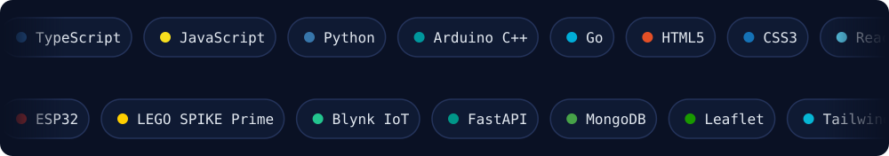

 


<a href="https://github.com/abivan100-stack/C.R.A.S.H">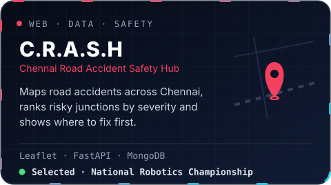</a>
<a href="https://abivan-dev.vercel.app/">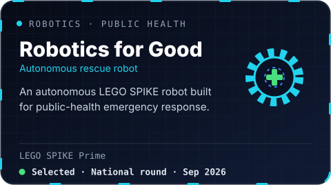</a>
<a href="https://abivan-dev.vercel.app/">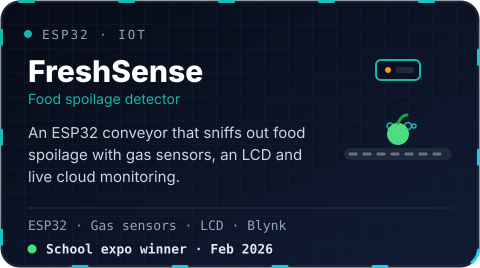</a>
<a href="https://abivan-dev.vercel.app/"></a>
<a href="https://abivan-dev.vercel.app/">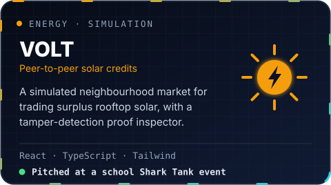</a>
<a href="https://abivan-dev.vercel.app/">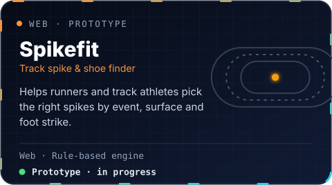</a>

 



 



 


 

