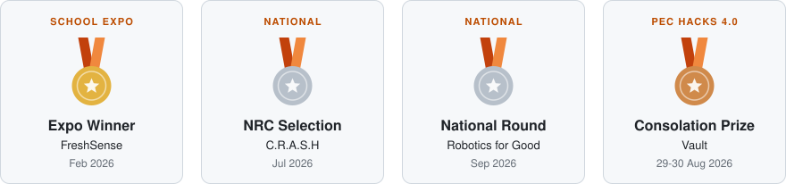

<h1 align="center">Hey, I'm Abivan </h1>

<i>Robots, ESP32 gadgets and web apps, built in Chennai</i>

  
  &nbsp;
  
  &nbsp;
  

I'm a student builder who likes turning ideas into things you can actually hold, wire up or click.
Most of my projects start with a real problem, like risky road junctions or spoiled food,
and end up at a competition table. Right now that means robots, ESP32 sensors and full-stack web apps.

  <a href="https://www.typescriptlang.org/" title="TypeScript"><picture><source media="(prefers-color-scheme: light)" srcset="https://skillicons.dev/icons?i=ts&theme=light"></picture></a>
  &nbsp;<a href="https://developer.mozilla.org/docs/Web/JavaScript" title="JavaScript"><picture><source media="(prefers-color-scheme: light)" srcset="https://skillicons.dev/icons?i=js&theme=light"></picture></a>
  &nbsp;<a href="https://www.python.org/" title="Python"><picture><source media="(prefers-color-scheme: light)" srcset="https://skillicons.dev/icons?i=py&theme=light"></picture></a>
  &nbsp;<a href="https://isocpp.org/" title="C++"><picture><source media="(prefers-color-scheme: light)" srcset="https://skillicons.dev/icons?i=cpp&theme=light"></picture></a>
  &nbsp;<a href="https://go.dev/" title="Go"><picture><source media="(prefers-color-scheme: light)" srcset="https://skillicons.dev/icons?i=go&theme=light"></picture></a>
  &nbsp;<a href="https://developer.mozilla.org/docs/Web/HTML" title="HTML"><picture><source media="(prefers-color-scheme: light)" srcset="https://skillicons.dev/icons?i=html&theme=light"></picture></a>
  &nbsp;<a href="https://developer.mozilla.org/docs/Web/CSS" title="CSS"><picture><source media="(prefers-color-scheme: light)" srcset="https://skillicons.dev/icons?i=css&theme=light"></picture></a>
    
  <a href="https://react.dev/" title="React"><picture><source media="(prefers-color-scheme: light)" srcset="https://skillicons.dev/icons?i=react&theme=light"></picture></a>
  &nbsp;<a href="https://vite.dev/" title="Vite"><picture><source media="(prefers-color-scheme: light)" srcset="https://skillicons.dev/icons?i=vite&theme=light"></picture></a>
  &nbsp;<a href="https://tailwindcss.com/" title="Tailwind CSS"><picture><source media="(prefers-color-scheme: light)" srcset="https://skillicons.dev/icons?i=tailwind&theme=light"></picture></a>
  &nbsp;<a href="https://fastapi.tiangolo.com/" title="FastAPI"><picture><source media="(prefers-color-scheme: light)" srcset="https://skillicons.dev/icons?i=fastapi&theme=light"></picture></a>
  &nbsp;<a href="https://www.mongodb.com/" title="MongoDB"><picture><source media="(prefers-color-scheme: light)" srcset="https://skillicons.dev/icons?i=mongodb&theme=light"></picture></a>
  &nbsp;<a href="https://www.arduino.cc/" title="Arduino"><picture><source media="(prefers-color-scheme: light)" srcset="https://skillicons.dev/icons?i=arduino&theme=light"></picture></a>
  &nbsp;<a href="https://git-scm.com/" title="Git"><picture><source media="(prefers-color-scheme: light)" srcset="https://skillicons.dev/icons?i=git&theme=light"></picture></a>
  &nbsp;<a href="https://vercel.com/" title="Vercel"><picture><source media="(prefers-color-scheme: light)" srcset="https://skillicons.dev/icons?i=vercel&theme=light"></picture></a>
  &nbsp;<a href="https://docs.claude.com/en/docs/claude-code/overview" title="Claude Code"><picture><source media="(prefers-color-scheme: light)" srcset="img/claude-code-light.svg"></picture></a>

<h3 align="center">Highlights</h3>

  <a href="https://abivan-dev.vercel.app/">
    <picture>
      <source media="(prefers-color-scheme: dark)" srcset="img/highlights-dark.svg">
      
    </picture>
  </a>

<h3 align="center">Things I've built</h3>

| Project | What it does | Built with |
|:--|:--|:--|
| [**C.R.A.S.H**](https://github.com/abivan100-stack/C.R.A.S.H) | Maps road accidents in Chennai and ranks which junctions to fix first | FastAPI, MongoDB, Leaflet |
| [**Robotics for Good**](https://abivan-dev.vercel.app/) | Autonomous LEGO SPIKE robot for public-health emergencies | LEGO SPIKE Prime |
| [**FreshSense**](https://abivan-dev.vercel.app/) | ESP32 conveyor that sniffs out spoiled food with gas sensors | ESP32, gas sensors, Blynk |
| [**Vault**](https://abivan-dev.vercel.app/) | Cold-chain logger that seals readings in a hash-chained ledger | React, TypeScript, ESP32 |
| [**VOLT**](https://abivan-dev.vercel.app/) | Neighbourhood solar-credit trading simulator | React, TypeScript, Tailwind |
| [**kvdb**](https://github.com/abivan100-stack/kvdb) | Key-value database written from scratch | Go |

<h3 align="center">Activity</h3>

  <a href="https://github.com/abivan100-stack">
    <picture>
      <source media="(prefers-color-scheme: light)" srcset="https://streak-stats.demolab.com/?user=abivan100-stack&hide_border=true&background=F6F8FA&ring=BC4C00&fire=BC4C00&currStreakNum=1F2328&sideNums=1F2328&currStreakLabel=BC4C00&sideLabels=656D76&dates=656D76&stroke=D0D7DE">
      
    </picture>
  </a>

Currently building a new ESP32 project for the National Robotics Championship (Nov 2026) &nbsp;·&nbsp; More on <a href="https://abivan-dev.vercel.app/">my portfolio</a>

